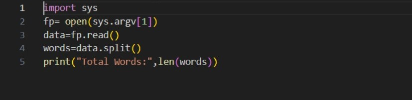
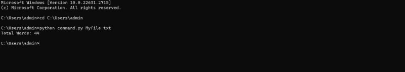

# command-line-arguments-to-count-word
## AIM:
To write a python program for getting the word count from the contents of a file using command line arguments.
## EQUIPEMENT'S REQUIRED: 
PC
Anaconda - Python 3.7
## ALGORITHM: 
### Step 1:
import the module sys
### Step 2: 
initially a variable count = 0
### Step 3: 
open the content file using command line arguments.
### Step 4:  
by using for loop name the function as "line"
### Step 5: 
split the line using .split
### Step 6: 
then in for loop and count the words and print the number of words
## PROGRAM:
```py
'''
Program for getting the word count from the contents of a file using command line arguments
Developed by:Vikamuhan Reddy N
RegisterNumber: 212223240181
'''
import sys
fp=open(sys.argv[1],'r')
count=0
for line in fp:
    words=line.split()
    count+=len(words)
print("Number of words in a file",count)
```
### OUTPUT:




## RESULT:
Thus the program is written to find the word count from the contents of a file using command line arguments.
